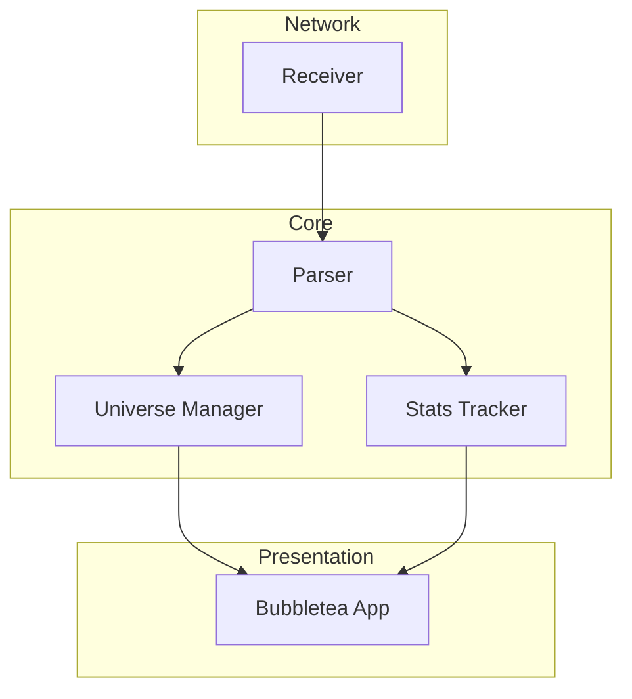

# Architecture

## Overview

sacn-monitor is a TUI application for monitoring sACN/E1.31 traffic. It follows a layered architecture with clear separation of concerns.



## Package Structure

| Package | Responsibility |
|---------|----------------|
| `cmd/sacn-monitor` | Entry point, wiring |
| `internal/sacn` | Network receiving, E1.31 parsing |
| `internal/universe` | Universe/channel state management |
| `internal/stats` | Packet rate, loss detection, sources |
| `internal/tui` | Bubbletea UI components |

---

## Component Details

### sacn/receiver.go

Listens on UDP port 5568 for:
- **Multicast**: Joins groups 239.255.x.x for universes 1-63 by default
- **Unicast/Broadcast**: Receives on all interfaces

Packets are parsed and sent to a buffered channel for consumption.

### sacn/parser.go

Parses raw E1.31 packets according to ANSI E1.31-2018:
- Validates preamble, ACN identifier, vectors
- Extracts CID, source name, priority, sequence, universe, channel data

### universe/manager.go

Thread-safe management of all discovered universes:
- Auto-creates universes on first packet
- Tracks per-channel active/inactive state
- Supports staleness detection for cleanup

### stats/tracker.go

Per-universe statistics:
- **Packet rate**: Sliding window (1 second)
- **Packet loss**: Sequence number gap detection
- **Sources**: Tracks unique CID + names

### tui/app.go

Bubbletea model with:
- Universe tabs for navigation
- Channel grid with bordered cards
- Real-time stats display

---

## Extending the Tool

### Adding a New Statistic

1. Add field to `stats.UniverseStats`
2. Update `RecordPacket()` to compute it
3. Add getter method
4. Update TUI `renderStats()` to display it

### Supporting Additional Protocols

Create a new receiver type implementing:
```go
type Receiver interface {
    Start(ctx context.Context) error
    Packets() <-chan *Packet
    Stop()
}
```

### Adding Export Features

Add a new package `internal/export` with:
```go
type Exporter interface {
    Export(universes []*universe.Universe) error
}
```

Implementations could include CSV, JSON, or real-time streaming.

### Customizing the UI

The TUI uses lipgloss for styling. Key style variables in `tui/app.go`:
- `activeCardStyle` - Cyan bordered cards
- `inactiveCardStyle` - Gray bordered cards
- Colors defined at package level

---

## Data Flow

```
UDP Packet → Receiver → Parser → [Universe Manager, Stats Tracker] → TUI
```

1. **Receiver** reads raw UDP data
2. **Parser** validates and extracts fields into `Packet` struct
3. **Main goroutine** distributes to:
   - Universe Manager (channel values)
   - Stats Tracker (rate, loss, sources)
4. **TUI** polls managers on tick for display updates
